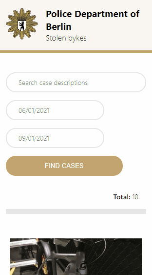

<p align="center">
  <a href="https://stolen-bikes-index.herokuapp.com/" target="_blank">
    
  </a>
</p>

<h1 align="center">Stolen Bike Index</h1>

<p align="center">
  <a href="https://stolen-bikes-index.herokuapp.com/" target="_blank">
    
  </a>
  <a href="https://stolen-bikes-index-app.herokuapp.com/" target="_blank">
    
  </a>
  <a href="#setup">
    
  </a>
  <a href="#tests">
    
  </a>
  <a href="CHANGELOG.md" target="_blank">
    
  </a>
</p>

This project has developed using React, TypeScript, Styled-Components, ESLint and follow the Git Flow praticses.

<br>



<br>

## **Requirements to development**

- node >=14
- npm >=6
- vscode (include extensions)

### vscode extension

- ESLint
- Prettier

<br>

---

<br>
<a name="setup"></a>

## **Initial setup**

### Create `.env` file

```bash
FAST_REFRESH=false
PORT=3001
REACT_APP_BIKE_API=https://bikewise.org/api/v2
```

### Install packages dependencies

Run the command below from this root path

```terminal
yarn or npm install
```

### Run local

```terminal
yarn dev or npm dev
```


<br>

---

<br>
<a name="tests"></a>

## **Test**

### Run local tests

Run the command below from this root path

```terminal
yarn test or npm test
```
